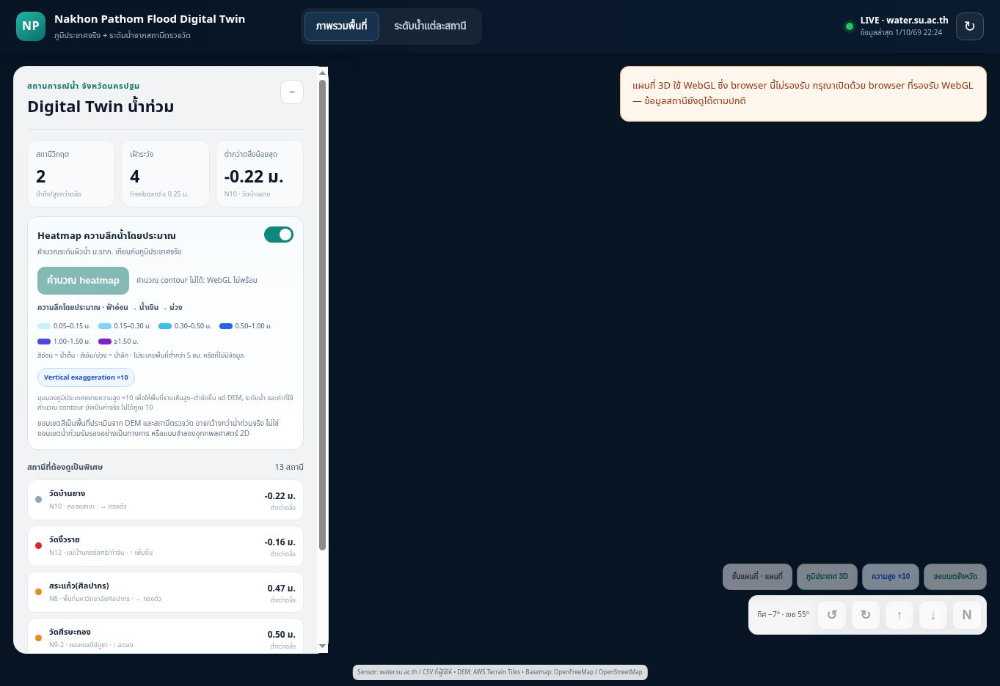

# Flood-depth heatmap — 2026-10-01

The previous renderer drew D3's cumulative contour polygons as translucent fills. A deep location could receive six fills (at 0.05, 0.15, 0.30, 0.50, 1.00 and 1.50 m). At opacity 0.46 per fill, six overlaps approach 98% opacity, making deeper areas look like a nearly solid overlay.

The renderer now subtracts each next cumulative contour from the previous one using Turf difference. Each location receives one non-overlapping depth band. The total model footprint and the sampled depth values remain unchanged.

| Estimated depth | Display |
| --- | --- |
| 0.05–0.15 m | Very pale blue, low opacity |
| 0.15–0.30 m | Light blue |
| 0.30–0.50 m | Cyan-blue |
| 0.50–1.00 m | Blue |
| 1.00–1.50 m | Indigo |
| ≥1.50 m | Purple |

The palette, ranges and opacity are defined once in `public/flood-bands.js` and shared by the legend and polygon properties. The legend remains visible on narrow layouts. Dry/under-5cm and missing-data cells are not filled. No polygon-subtraction failure falls back to overlapping fills.

## Verification

`npm test`: **18/18 PASS**, including real D3/Turf geometry checks for non-overlapping bands, conserved total footprint, unchanged input depths, a uniform deep grid becoming one purple band, unknown/dry grids remaining unfilled, and explicit handling of geometry failures. Existing 1x/10x, map-control, basemap-state and realtime adapter tests also pass.

Tests install the exact locked dev dependencies before execution, including on the existing Render service whose build command is `npm test`. The browser D3/Turf versions are pinned to the tested releases.

## Interpretation limits

This change corrects the visual exaggeration caused by stacked fills. It does **not** establish that the model's estimated extent is the actual flood extent. The existing model interpolates water-surface elevations from stations over a limited distance and compares them to a terrain DEM. It does not simulate hydraulic connectivity, levees, drainage, land-cover barriers or calibrated 2D flow. Areas can therefore be overestimated even with a correct colour scale. Confirmation of extent requires independent flood observations and evaluation of DEM/station vertical datums and waterway connectivity; colours must not be adjusted to hide that uncertainty.

Terrain exaggeration remains visual only; water depth and sensor values remain in actual metres. The existing 3.0 m depth cap is unchanged.

## Deployment and live browser checks

- Application commit: `720415a9a10364b8e93f9d14be1a06ed4096ed2f`.
- Render deploy: `dep-dav7lufpn0mc73aijpn0`, **live** at 2026-10-01T15:24:06Z.
- Public URL: https://nakhonpathom-flood-v2.onrender.com/
- The real browser displays the new heatmap title, all six ranges and the model-uncertainty note.
- Map rendering remains unverified: this Work browser has no WebGL, as recorded in `WORK_QA.md`. Automated geometry tests verify the fix, but are not a visual pass on the actual map.
- No new application runtime error was observed after loading the new assets; browser extension metadata errors remain external to the app.

