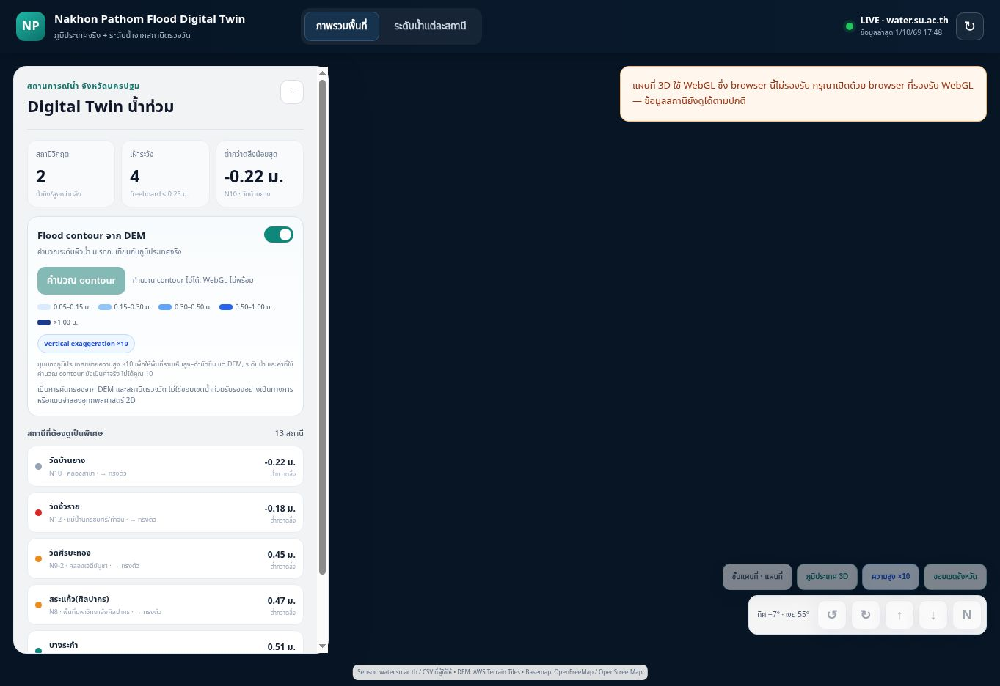

# Work implementation and deployment QA — 2026-10-01

## Overall result: BLOCKED — acceptance is not fully verified

The requested implementation is deployed. Do not interpret the passing automated tests or live deployment as a pass of visual 3D browser acceptance.

- Baseline: `eb135e1a94c832e3e67ce4b8e7721461c9022f40`.
- Implementation: `91354e3c7208f6c0663d59fad9a3de57099ffa52`.
- Latest application commit (includes notice placement and cache refresh): `a85a4664cc0b50cb1bf08932ad38bea73fdbe0da`.
- Render service: `srv-dav2qu8473hc73da4hsg`.
- Latest deploy: `dep-dav3lcl9fdbs73b4l5b0`, status **live** (2026-10-01T10:49:49Z).
- Public URL: https://nakhonpathom-flood-v2.onrender.com/

## Implemented

- Default visual exaggeration is 10x; control toggles 1x/10x, and the badge states the active exaggeration. No camera reset or hydraulic rescaling is performed by this control.
- Dedicated satellite and contour raster layers are inserted beneath the existing vector layers and custom overlays. Visibility toggling preserves map instances, overlay data, selected station, camera and terrain. No `setStyle` is used.
- Manual camera buttons rotate ±15°, adjust pitch ±10° within 0–75°, or reset bearing to north. Center and zoom are explicitly preserved. Continuous rotation was removed; native drag/touch rotation remains enabled.
- DEM samples continue to use `queryTerrainElevation(..., { exaggerated: false })`. Missing DEM samples are excluded rather than being converted from null to elevation zero.
- Unsupported WebGL is reported visibly; live sensors, the station table and station details still work. Map controls are disabled when the renderer is unavailable.
- Map-provider attribution and terms are documented in `BASEMAP_SOURCES.md`. The screening-model disclaimer is visible in the overview.

## Evidence and acceptance matrix

| Requirement | Automated / service evidence | Actual browser result |
| --- | --- | --- |
| Syntax and adapter tests | `npm test`: 14/14 PASS, including server, adapter and browser syntax | N/A |
| 1x/10x does not change numerical values | Actual browser-app code executed in a mocked MapLibre/DOM harness; identical sensor details and sampled model depths at 1x/10x, all terrain queries unexaggerated | Visual relief comparison BLOCKED |
| Basemap preserves camera, station, flood visibility and terrain | Harness PASS for map/satellite/contour, including flood toggle off and unchanged selected station | Tile rendering, attribution display and sensor clicking on map BLOCKED |
| Satellite and contour provider connectivity | Image requests at the monitored area returned HTTP 200 (`image/jpeg` and `image/png`); OpenFreeMap style also returned HTTP 200 via curl | Actual map rendering BLOCKED; HTTP checks are not a substitute for browser QA |
| Manual controls preserve center/zoom and clamp pitch | Harness PASS in all three basemaps; no auto-rotation state remains | Real camera motion, drag and touch rotation BLOCKED |
| Live source | Health endpoint OK; `/api/sensors` mode=live, source=`water.su.ac.th/api/v1/water/latest-all`, 13 sensors; Render startup probe mode=live, sensorCount=13 | PASS: LIVE badge and 13 table rows observed; station N12 opens details |
| Desktop UI without WebGL | Live data initialization is independent of the map renderer | PASS for live data, table/detail navigation and explicit renderer-unavailable message |
| Browser runtime errors | New deployment did not emit application errors in the inspected browser logs | Extension metadata errors were emitted by the cloud browser extension; baseline MapLibre threw a WebGL context creation error before the fix |
| Mobile viewport | Responsive control styles implemented | NOT RUN: supported browser surface did not expose viewport resizing; WebGL is unavailable in this browser as well |

## Concrete QA blocker

The Work cloud browser reports `GL_VENDOR = Disabled`, `GL_RENDERER = Disabled` and cannot create a WebGL context. The baseline app failed before rendering any map. The deployed version detects this condition and keeps live sensor data usable. This is not evidence that the 3D view works on a WebGL-capable device.

No supported browser capability was available to enable WebGL. A mobile preview navigation using a `data:` URL was rejected by the browser URL policy; that route was stopped and no workaround was attempted. A real mobile-sized viewport remains untested.

## Remaining verification

On a supported WebGL browser, verify the public URL at desktop and mobile sizes:

1. Wait for LIVE and 13 stations, terrain and flood-model readiness.
2. Select a station, note water, bank and freeboard values, and record center/zoom/pitch/bearing.
3. Switch Map → Satellite → Contour. Inspect loaded tiles, attribution, province boundary, flood overlay and clickable sensors. Camera and selected-station state must remain unchanged.
4. Toggle flood off, change basemap, confirm it stays off, then toggle on.
5. Switch 10x → 1x → 10x. Compare visible relief; numeric values must remain unchanged within one live-data refresh period. Every DEM calculation must remain unexaggerated.
6. Click left/right/up/down/north in each basemap. Confirm controlled steps, pitch bounds, unchanged center/zoom, retained 10x terrain, and no continuing spin. Test native drag/touch rotation.
7. Inspect application console/runtime errors and mobile control overlap/attribution. Only then mark the remaining browser acceptance rows PASS.

Render did not create a new automatic deploy after publishing main; deployments were explicitly triggered against the verified new commits. Do not assume that the service's autoDeploy field means the webhook path is working.

## Screenshot

